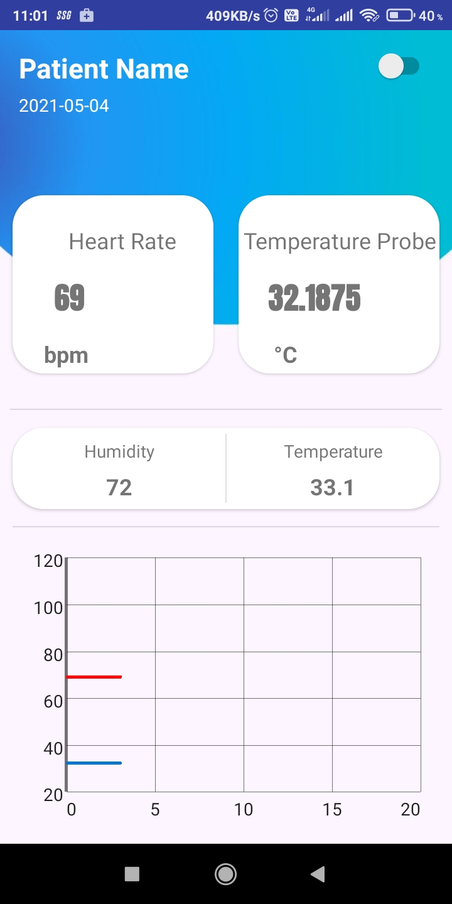

# HealthCare
A patient Monitoring Android Application.
One can see real time patient's body temperature, heart rate, surrounding humidity and temperature.
Beep Alarm begins when temperatue or heart rate goes beyond limits.

